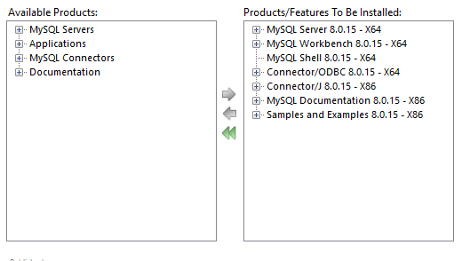

# Introduction to Databases.

## MySQL Installation Instruction:

* Download mysql-installer-web-community.exe from [this site](http://dev.mysql.com/downloads/installer/).
* Start the installation
* For installation type select Custom and choose the following components: 

* If the installer displays a message, that there are unsatisfied requirements, click the execute button to download them and install automatically
* During server configuration, select the default options. Select the root password (make sure you remember it). You may want to unselect the checkbox "Start MySQL Server at System Startup".
* Finish the installation and start the workbench.
* Double click on the Local Instance under MySQL Connections.

## Import sample DB:

* From the workbench, open the script **mysqlsampledatabese.sql** (File -> Open SQL Script)
* Run the script by clicking the lightning button
* Refresh the schemas view

## Exercises:

1. Select all records of the employee table

2. Select all records of the employee table, but view only the first name, last name, and job title 

3. Make the previous selection, but order by last name

4. Find out the different job titles in the employee table

5. Find all different last names in the employee table and display them alphabetically

6. Find all different first names in the employee table and display them alphabetically

7. Display the number of records in the employee table

8. Display the number of different last names in the employee table

9. Display the number of different first names in the employee table

10. Display all different state and city pairs from the customers table

11. Display the previous query, but exclude records where the state is null

12. Display the previous query, but exclude records where the state is null but order alphabetically first by state and then by city.

13. Find all the different countries in the customers table

14. Find the names of employees, whose job title is 'Sales Rep'

15. Execute the previous query, but add the condition that the office code is 1;

16. Find the number of employees, whose job title is 'Sales Rep'

17. Execute the previous query, but add the condition that the office code is 1;

18. Find the names of employees, whose job title is NOT 'Sales Rep'

19. Find the number of employees, whose job title is NOT 'Sales Rep'

20. Find the different office codes in the employee table 

21. Find the names of employees, whose office code is greater than 5

22. Find the product names, codes and prices from the products table, whose price is between 90 and 100

23. Find the product names, codes and prices from the products table, whose price is NOT between 20 and 80

24. Select all the names of employees, whose last name ends in 'on'

25. Select all the names of employees, whose last name contains 'on'

26. Select all the names of employees, whose last name does not start with B

27. Select all customers from the customers table whose country is USA and state is CA

28. For the group of customers in the previous query, find the names of the ones that have credit limit greater than 100 000

29. Find the names of the customers from North America (USA, Canada, Mexico)

30. Find the number of customers from the previous query

31. Find the customers from North America, who have credit limit, greater than 100 000.

32. Create a query, that does the same thing as query 29, but uses the IN operator

33. Find the customer names from the customers table, who are not in North America

34. Find the orders from the orders table, that have an order number of 10165, 10287, or 10310

35. From the orders table, for each status, find out the number of orders in that status

36. From the orderdetails table, for each product code, find out the number of times this product code was ordered. Order the results, starting with the largest number first.
 
37. From the orderdetails table, for each product code, find the total quantity, ordered for that product. Order the results, starting with the largest number first.

38. From the orderdetails table, for each product code, find the total amount of money, received from all orders. Order the results, starting with the largest amount first.

39. Find all the different product lines from the productLines table

40. Find all the product codes and names that belong to the product line 'Classic Cars'

41. Find all the product lines with the corresponding products that belong to them, sorted by product line.

42. Print all order number, date, and status from the orders table, together with the customer name.

43. From the orderdetails and the products table, find out the product code, product Name, and the number of times this product was ordered.

44. From the orderdetails and the products table, find out the product code, product Name, and the quantity ordered for this product.

45. From the orderdetails and the products table, find out the product code, product Name, and the total sales amount, received for this product from all orders.

46. Joining the orders and orderdetails tables, for every order print the order number, date, and the total amount for that order.

47. Create another product with a description '1962 Lada'. Choose an appropriate unique product code and make the product belong to the 'Vintage Cars' product line. To check the result, select all the vintage cars and make sure the new product is there.

48. Create an order for 5 '1962 Lada' model cars and associate it with a customer of your choice. 

49. Change the order that you created in 48 and make it for 6 instead of 5 cars.

50. Delete the record for the '1962 Lada' that you created and the associated order.

51. Create a database schema according to the following ER diagram. Make the accountType column in the account table enumeration with two values ENUM('checking', 'saving').

